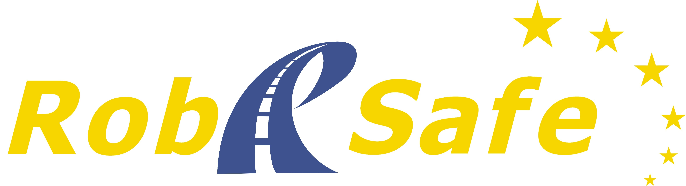
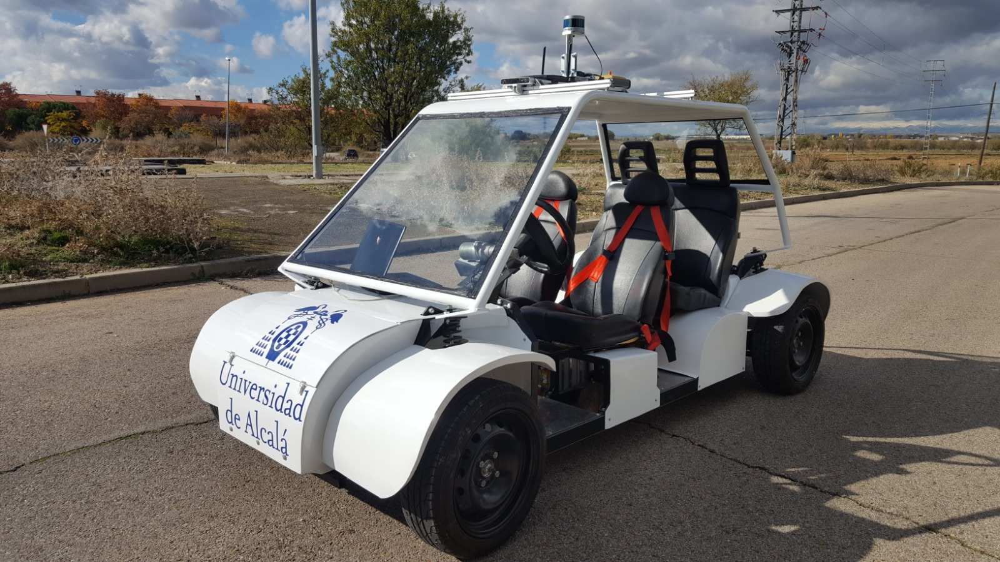

# OpenPCDet fork

`OpenPCDet` is a clear, simple, self-contained open source project for LiDAR-based 3D object detection. 

It is also the official code release of [`[PointRCNN]`](https://arxiv.org/abs/1812.04244), [`[Part-A^2 net]`](https://arxiv.org/abs/1907.03670) and [`[PV-RCNN]`](https://arxiv.org/abs/1912.13192). 

This fork provides the exact version used on Master's Final Project written by **Javier del Egido**. The project studies state-of-the-art Detection and Multi-Object Tracking  (DAMOT) proposals in order to desing a funcional pipeline to be embebbed on Nvidia Jetson AGX Xavier mounted on ["Techs4AgeCar vehicle"](http://www.robesafe.uah.es/index.php/es-es/) developed by ["Robesafe research group"](https://github.com/RobeSafe-UAH).
The fork provides ROS communications from PointCloud2 input to custom ["AB3DMOT Tracking module"](https://github.com/JavierEgido/AB3DMOT) in order to set a functional real-time Detection and Multi-Object Tracking (DAMOT) pipeline.

ROS messages provided by ["BEV_tracking ROS"](https://github.com/JavierEgido/bevtracking) package are needed.

<p align="center">
  
</p>


## Overview
- [Design Pattern](#openpcdet-design-pattern)
- [Model Zoo](#model-zoo)
- [Installation](docs/INSTALL.md)
- [Quick Demo](docs/DEMO.md)
- [Getting Started](docs/GETTING_STARTED.md)
- [Citation](#citation)


## Introduction


### What does `OpenPCDet` toolbox do?

Note that we have upgrated `PCDet` from `v0.1` to `v0.2` with pretty new structures to support various datasets and models.

`OpenPCDet` is a general PyTorch-based codebase for 3D object detection from point cloud. 
It currently supports multiple state-of-the-art 3D object detection methods with highly refactored codes for both one-stage and two-stage 3D detection frameworks.

Based on `OpenPCDet` toolbox, we win the Waymo Open Dataset challenge in [3D Detection](https://waymo.com/open/challenges/3d-detection/), 
[3D Tracking](https://waymo.com/open/challenges/3d-tracking/), [Domain Adaptation](https://waymo.com/open/challenges/domain-adaptation/) 
three tracks among all LiDAR-only methods, and the Waymo related models will be released to `OpenPCDet` soon.    

We are actively updating this repo currently, and more datasets and models will be supported soon. 
Contributions are also welcomed. 

## Model Zoo

### KITTI 3D Object Detection Baselines
Selected supported methods are shown in the below table. The results are the 3D detection performance of moderate difficulty on the *val* set of KITTI dataset.
* All models are trained with 8 GTX 1080Ti GPUs and are available for download. 
* The training time is measured with 8 TITAN XP GPUs and PyTorch 1.5.

|                                             | training time | Car | Pedestrian | Cyclist  | download | 
|---------------------------------------------|----------:|:-------:|:-------:|:-------:|:---------:|
| [PointPillar](tools/cfgs/kitti_models/pointpillar.yaml) |~1.2 hours| 77.28 | 52.29 | 62.68 | [model-18M](https://drive.google.com/file/d/1wMxWTpU1qUoY3DsCH31WJmvJxcjFXKlm/view?usp=sharing) | 
| [SECOND](tools/cfgs/kitti_models/second.yaml)       |  ~1.7 hours  | 78.62 | 52.98 | 67.15 | [model-20M](https://drive.google.com/file/d/1-01zsPOsqanZQqIIyy7FpNXStL3y4jdR/view?usp=sharing) |
| [PointRCNN](tools/cfgs/kitti_models/pointrcnn.yaml) | ~3 hours | 78.70 | 54.41 | 72.11 | [model-16M](https://drive.google.com/file/d/1BCX9wMn-GYAfSOPpyxf6Iv6fc0qKLSiU/view?usp=sharing)| 
| [PointRCNN-IoU](tools/cfgs/kitti_models/pointrcnn_iou.yaml) | ~3 hours | 78.75 | 58.32 | 71.34 | [model-16M](https://drive.google.com/file/d/1V0vNZ3lAHpEEt0MlT80eL2f41K2tHm_D/view?usp=sharing)|
| [Part-A^2-Free](tools/cfgs/kitti_models/PartA2_free.yaml)   | ~3.8 hours| 78.72 | 65.99 | 74.29 | [model-226M](https://drive.google.com/file/d/1lcUUxF8mJgZ_e-tZhP1XNQtTBuC-R0zr/view?usp=sharing) |
| [Part-A^2-Anchor](tools/cfgs/kitti_models/PartA2.yaml)    | ~4.3 hours| 79.40 | 60.05 | 69.90 | [model-244M](https://drive.google.com/file/d/10GK1aCkLqxGNeX3lVu8cLZyE0G8002hY/view?usp=sharing) |
| [PV-RCNN](tools/cfgs/kitti_models/pv_rcnn.yaml) | ~5 hours| 83.61 | 57.90 | 70.47 | [model-50M](https://drive.google.com/file/d/1lIOq4Hxr0W3qsX83ilQv0nk1Cls6KAr-/view?usp=sharing) |

### NuScenes 3D Object Detection Baselines
All models are trained with 8 GTX 1080Ti GPUs and are available for download.

|                                             | mATE | mASE | mAOE | mAVE | mAAE | mAP | NDS | download | 
|---------------------------------------------|----------:|:-------:|:-------:|:-------:|:---------:|:-------:|:-------:|:---------:|
| [PointPillar-MultiHead](tools/cfgs/nuscenes_models/cbgs_pp_multihead.yaml) | 33.87	| 26.00 | 32.07	| 28.74 | 20.15 | 44.63 | 58.23	 | [model-23M](https://drive.google.com/file/d/1fnxKTUi79dSARhsREXR_UKnWs-83bgEV/view?usp=sharing) | 
| [SECOND-MultiHead (CBGS)](tools/cfgs/nuscenes_models/cbgs_second_multihead.yaml) | 31.15 |	25.51 |	26.64 | 26.26 | 20.46 | 50.59 | 62.29 | [model-35M](https://drive.google.com/file/d/1s34D8g-h65qDyoYbgCraxcZQwinbxhaY/view?usp=sharing) |

## Installation

Please refer to [INSTALL.md](docs/INSTALL.md) for the installation of `OpenPCDet`.


## Quick Demo
Please refer to [DEMO.md](docs/DEMO.md) for a quick demo to test with a pretrained model and 
visualize the predicted results on your custom data or the original KITTI data.

## Getting Started

Please refer to [GETTING_STARTED.md](docs/GETTING_STARTED.md) to learn more usage about this project.

To directly inference on ROS point cloud, run:
  ```
  $ python inference.py
  ```
You may need to adjust input point cloud name at the end of code. Also some parameters can be tuned:
- [x] Movelidartocenter (in meters): moves point cloud along X-axis in order to inference over 360º. By default, detection grid only applies over front point cloud.
- [x] Threshold (0 to 1 float): sets score minimum threshold for objects to be published as detected.

## Docker

If you prefer to install OpenPCDet as a Docker image, you can download provided image on ["link"](https://mega.nz/file/2UJyBRDB#gb0Iz5FWhR2kuLAbHNAzhsrv4Zu74NW5Eg9pEasLfME).
Install docker image by using: docker load --input OpenPCDet.tar 

## License

`OpenPCDet` is released under the [Apache 2.0 license](LICENSE).

## Acknowledgement
`OpenPCDet` is an open source project for LiDAR-based 3D scene perception that supports multiple
LiDAR-based perception models as shown above. Some parts of `PCDet` are learned from the official released codes of the above supported methods. 
We would like to thank for their proposed methods and the official implementation.   

We hope that this repo could serve as a strong and flexible codebase to benefit the research community by speeding up the process of reimplementing previous works and/or developing new methods.

## `OpenPCDet` design pattern

* Data-Model separation with unified point cloud coordinate for easily extending to custom datasets:
<p align="center">
  
</p>

* Unified 3D box definition: (x, y, z, dx, dy, dz, heading).

* Flexible and clear model structure to easily support various 3D detection models: 
<p align="center">
  
</p>

* Support various models within one framework as: 
<p align="center">
  
</p>


## Currently Supported Features

- [x] Support both one-stage and two-stage 3D object detection frameworks
- [x] Support distributed training & testing with multiple GPUs and multiple machines
- [x] Support multiple heads on different scales to detect different classes
- [x] Support stacked version set abstraction to encode various number of points in different scenes
- [x] Support Adaptive Training Sample Selection (ATSS) for target assignment
- [x] Support RoI-aware point cloud pooling & RoI-grid point cloud pooling
- [x] Support GPU version 3D IoU calculation and rotated NMS 


## Citation 
If you find this project useful in your research, please consider cite:


```
@inproceedings{shi2020pv,
  title={Pv-rcnn: Point-voxel feature set abstraction for 3d object detection},
  author={Shi, Shaoshuai and Guo, Chaoxu and Jiang, Li and Wang, Zhe and Shi, Jianping and Wang, Xiaogang and Li, Hongsheng},
  booktitle={Proceedings of the IEEE/CVF Conference on Computer Vision and Pattern Recognition},
  pages={10529--10538},
  year={2020}
}


@article{shi2020points,
  title={From Points to Parts: 3D Object Detection from Point Cloud with Part-aware and Part-aggregation Network},
  author={Shi, Shaoshuai and Wang, Zhe and Shi, Jianping and Wang, Xiaogang and Li, Hongsheng},
  journal={IEEE Transactions on Pattern Analysis and Machine Intelligence},
  year={2020},
  publisher={IEEE}
}

@inproceedings{shi2019pointrcnn,
  title={PointRCNN: 3d Object Progposal Generation and Detection from Point Cloud},
  author={Shi, Shaoshuai and Wang, Xiaogang and Li, Hongsheng},
  booktitle={Proceedings of the IEEE Conference on Computer Vision and Pattern Recognition},
  pages={770--779},
  year={2019}
}
```

## Contact
The original project is currently maintained by Shaoshuai Shi ([@sshaoshuai](http://github.com/sshaoshuai)) and Chaoxu Guo ([@Gus-Guo](https://github.com/Gus-Guo)).

This fork is maintained by ["Javier del Egido"](https://github.com/JavierEgido) and ["Robesafe research group"](https://github.com/RobeSafe-UAH)
